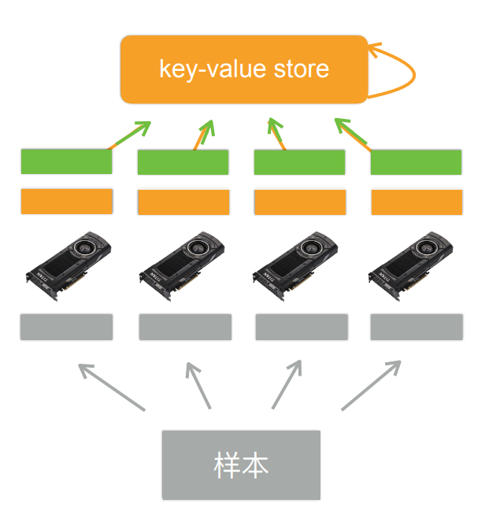

## 单机多卡并行

一台机器可以安装多个GPU（一般为1-16个），在训练和预测时可以将一个小批量计算切分到多个GPU上来达到加速目的，常用的切分方案有数据并行，模型并行，通道并行。

### 数据并行

将小批量的数据分为n块，每个GPU拿到完整的参数，对这一块的数据进行前向传播与反向传播，计算梯度。

数据并行通常性能比模型并行更好，因为对数据进行划分使得各个GPU的计算内容更加均匀。

#### 数据并行的大致流程

主要分为五部

* 1：每个GPU读取一个数据块（灰色部分）
* 2：每个GPU读取当前模型的参数（橙色部分）
* 3：每个GPU计算自己拿到数据块的梯度（绿色部分）
* 4：GPU将计算得到的梯度传给内存（CPU）（绿色箭头）
* 5：利用梯度对模型参数进行更新（橙色箭头）

数据并行并行性较好，主要因为当每个GPU拿到的数据量相同时计算量也相似，各个GPU的运算时间相近，幸能较好

### 模型并行

将整个模型分为n个部分，每个GPU拿到这个部分的参数和负责上一个部分的GPU的输出作为输入来进行计算，反向传播同理。

模型并行通常用于模型十分巨大，参数众多，即使在每个mini-batch只有一个样本的情况下单个GPU的显存仍然不够的情况，但并行性较差，可能有时会有GPU处于等待状态。

### 通道并行

通道并行是数据并行和模型并行同时进行

### 总结

* 当一个模型能用单卡计算时，通常使用数据并行扩展到多卡
* 模型并行则用在超大模型上

### Q&A（部分有价值的）

* 问1：若有4块GPU，两块显存大两块显存小怎么办？
* 答1：
  若GPU运算性能相同，则训练取决于小显存的GPU的显存大小，更大的显存相当于浪费掉
  若GPU运算性能不同，一般即为显存大的GPU性能更好，可以在分配数据时多分配一点
* 
* 问2：数据拆分后，需存储的数据量会变大吗？会降低性能吗？
* 答2：每个GPU都单独存储了一份模型，这部分的数据量变大了，但如果只考虑运算时的中间变量，则中间变量的大小与数据量呈线性关系，每个GPU的数据小了，中间变量也会变小，所有GPU的中间变量加起来大小是不变的。
  数据拆分后性能会变低，在下节课讲解（数据通讯的开销，每个GPU的batch-size变小可能无法跑满GPU，总batch-size变大则相同计算量下训练次数变少）